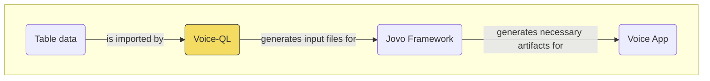
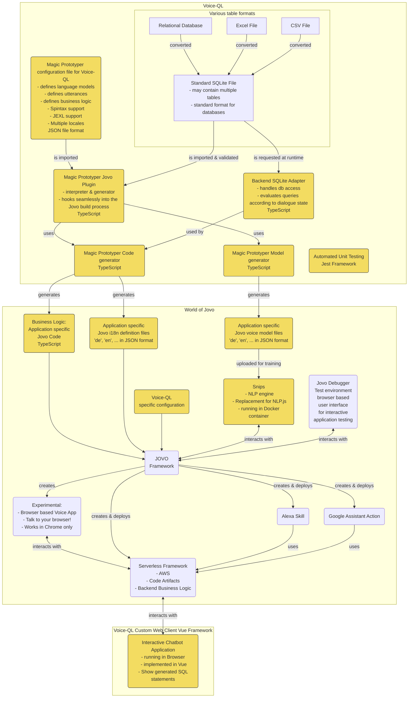
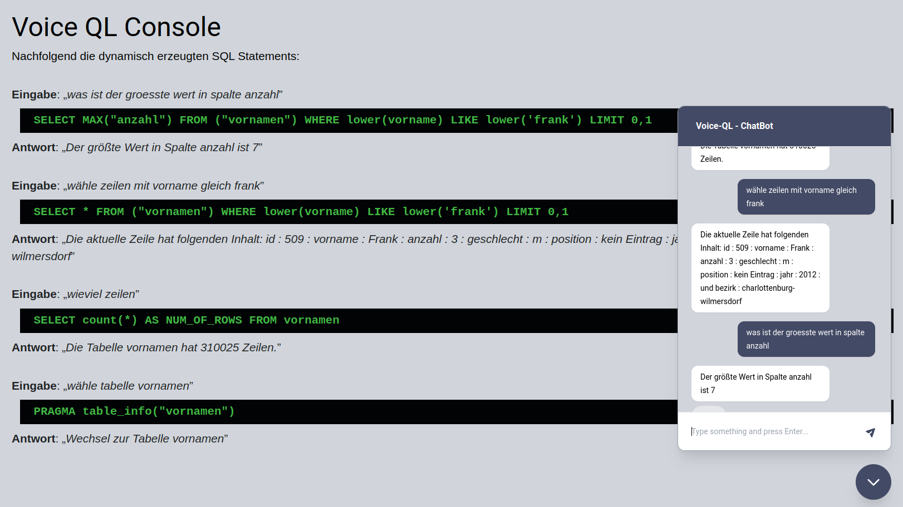

<a href= "https://prototypefund.de/project/voice-ql-datentabellen-mit-gesprochener-sprache-barrierefrei-erkunden/"></a>

# Voice-QL - Talk to your Database - Main Project

## What this project is about

A digitized world offers numerous benefits, such as making information easily accessible to a wider audience.

This is the one of the promises which come with Open Data initiatives: making data freely available to the public for reuse and analysis. The vision is to make government, scientific, and other types of data easily accessible to the public, allowing for the development of new products, services, and insights.

However, not everyone has equal access to these digital resources. Some segments of the population face obstacles that prevent them from accessing the information they need. People with visual or motor impairments, for instance, are often excluded from the digital world.

But sometimes data itself is presented in a way which makes it inherently difficult to retrieve information from it for everybody. This is especially true for large data sets. They are often presented in tabular form.

Without knowledge of database languages like SQL or without being a master of Excel, it can be difficult to extract and understand information hidden in the data.

Recognizing this challenge, the Voice-QL project has been launched to address the issue. The project aims to develop a **dialog model** for voice assistants that can then provide a more accessible way retrieving information from databases. The voice assistant responds to spoken or typed voice commands, allowing users to navigate through the contents of the database without the need to touch a screen or keyboard.

**In other words**: Voice-Ql is designed to address the challenge of accessing data and making it more accessible for everyone by using natural language as an interface.

Not only will Voice-QL make information more accessible for individuals, but it will also give organizations and individuals who contribute information to open data a new tool to reach a wider audience.

## Related projects

A number of additional github repositories contain material which has been implemented, adapted and/or preconfigured to be used with or without Voice-QL. You can find more information by following these links:

- Voice-QL - Use Snips NLU as replacement for NLP.js: [github](https://github.com/fboerncke/voice-ql-snips-nlu-server)
- Voice-QL - Web Client with SQL protocol display - Chat Widget: [github](https://github.com/fboerncke/voice-ql-vue-chat-client)

- Voice-QL - Talking Browser Demo - Use your browser o talk with your data: [github](https://github.com/fboerncke/voice-ql-vue-talking-client)

- **Model Linter**: [npm](https://www.npmjs.com/package/jovo-v4-community-hook-model-linter), [github](https://github.com/fboerncke/jovo-v4-community-hook-model-linter)

- **Magic Model**: [npm](https://www.npmjs.com/package/jovo-v4-community-hook-magic-model), [github](https://github.com/fboerncke/jovo-v4-community-hook-magic-model)

- **Magic Prototyper**: [npm](https://www.npmjs.com/package/jovo-v4-community-hook-magic-prototyper), [github](https://github.com/fboerncke/jovo-v4-community-hook-magic-prototyper)

## Overview

So how does Voice-QL work? What is the main idea?

The Voice-QL project is importing data from some table given in sqlite format using it to generate input files for the Jovo Framework, which in turn generates necessary artifacts for a Voice App.



The diagram illustrates how the Voice-QL project is transforming table data into a voice-based interface for accessing information. We will find a more image more below in this text.

## Example Dialogues based on real world data

Let us start with some examples of how a dialogue with the Voice QL may look like:

### Test data

For this example we use some real world data. Within an **Open Data** dictionary we found an table in **SQLite** format with information about what first names ("Vornamen") parents gave their childs.

The structure of the table looks as follows:

[](https://www.bmbf.de/)

A number of challenges come with this dataset:

- The name of the table is "**vornamen**", one column is named "**vorname**". This may cause conflicts when trying to understand spoken user intents.

- Some content is empty (**NULL**). The voice app will have to deal with that.

- The complete table has 300.000+ lines. How can a user get an idea what this content is about just by using spoken language as user interface? How to navigate in such an amount of data?

- If we ask for information matching a specific search criterion then the system may find hundreds or thousands of lines. It makes no sense to read them all aloud.

- A lot of entries contain **special characters** because the names chosen by parents come from different languages. This may cause problems with both understanding and responding to the user.

- When spoken aloud the column name "_Jahr_" sounds similar to "_Ja_" (German for "yes") which may make it diffult for a system to distiguish utterances using these words.

We will see how far we get ...

### Processing / Workflow

Using the Voice-QL setup this table is preprocessed, a matching voice model for the Jovo framework is created automatically and then some backend logic builds SQL statements on the fly from the content we find in the spoken user utterances.

Built on top of the [Jovo framework](https://jovo.tech) we can use Jovo to generate customized Voice Apps which will run on different platforms - for whatever platform Jovo supports now or will support in the future.

### Example Dialog

So what can the user do then when using such a voice app? The following example dialog shows what is possible right now.

Please note that depending on the final platform some examples may return different results. If you have a decision which platform you plan to support you will likely need to finetune your prototype to find the results you expect:

#### Support and guidance the user when information is missing

- User: "_Öffne Datenbank Test_"
- Assistant: "_Willkommen bei Voice-QL_"
- User: "_Was kann ich machen?_"
- Assistant: "_Frage zum Beispiel nach den Metadaten_"
- User: "_Was sind die Metadaten?_"
- Assistant: "_Du musst zuerst eine Tabelle der Datenbank mit ihrem gültigen Namen auswählen. Welche der folgenden Tabellen möchtest Du verwenden: Zur Verfügung stehen **vornamen**, **empty** und **griechisch**._"
- User: "_Wähle Tabelle **vornamen**_"
- Assistant: "_Die Tabelle mit dem Namen vornamen hat 310025 Zeilen und 7 Spalten. Die Namen der Spalten lauten id, vorname, anzahl, geschlecht, position, jahr und bezirk._"

In the above example we see that the system responds with a meaningful message in case some required information is missing. The system will ask for required parameters and proceeds with the previous request when the necessary information is available.

#### Conversational Context

A database may contain multiple tables and we can switch between the tables via voice command. The session will save such decisions and settings for later in a **context environment**. This way it is possible to automatically complete incomplete requests.

- User: "_Welche Tabellen gibt es?_"
- Assistant: "_Die Namen der Tabellen lauten '**Vornamen**', '**EMPTY**' und '**griechisch**'._"
- User: "_Wähle die Tabelle mit dem Namen 'Vornamen'_"
- Assistent: "_Wechsel zur Tabelle Vornamen._"

Further requests will use the context to build a complete SQL statement from whatever information is available.

#### From voice request to SQL statements

The system is doing it's best to understand the intent of the user and build a matching SQL statement from both the latest utterance and the context.

- User: "_Wie viele Spalten hast Du?_"
- Assistant: "_Die Tabelle 'Vornamen' hat sieben Spalten_"

The system assumes that the request refers to the table that has been chosen in an earlier request.

- User: "_Welche Namen haben die Spalten?_"
- Assistant: "_Die Namen der Spalten von der Tabelle 'Vornamen' lauten ID, Vorname, Anzahl, Geschlecht, Position, Jahr und Bezirk_"

Another example:

- User: "_Wie viele Zeilen hast Du?_"
- Assistant: "_Die Tabelle Vornamen hat 310025 Zeilen_"

Finally:

- User: "_Welchen Namen hat Spalte drei?_"
- Assistant: "_Der Name der Spalte drei von Tabelle Vornamen ist 'Anzahl'_"

#### Asking for column content

While above examples only show requests referring to metadata we can also use more complex statements:

- User: "_Was ist der größte Wert in Spalte 'Anzahl'_"
- Assistant: "_Der größte Wert in Spalte 'Anzahl' ist 128_"

The generated SQL query looks as follows:

    SELECT MAX('anzahl') FROM ("vornamen")

#### More complex statements

What is the name that has been chosen 128 times? The user can use the result '128' for another query.

For this the user may use an informal or a more technical approach:

Example for an informal approach using a more natural wording. This may be used by a non expert:

- User: "_Wähle Werte mit Anzahl gleich 128_"

Here is an example for a more technical approach using an SQL style request:

- User: "_SELECT STERN mit Spalte ANZAHL gleich 128_"

Both requests shown in above examples use a complete different wording but in both cases the system will recognize the same intent and build the same SQL query:g as follows:

    SELECT * FROM ("vornamen") WHERE anzahl = 128 LIMIT 1,1

In both cases the answer is the same:

- Assistent: "_Die aktuelle Zeile mit der Nummer 1 beinhaltet die folgenden Werte: id: 95302, vorname: Marie, anzahl: 128, geschlecht: w, position: kein Eintrag, jahr: 2015 und bezirk: pankow_"

There may be more than one result, but for a voice interface it makes sense to limit the output to one line only. This is a pattern which we use throughout the application.

#### Different SQL Queries based on different parameter Types

Above example shows a request referring to a **number** (128). When dealing with **strings** then SQL statements are built in another way. See the following example:

- User: "_Zeige Zeilen mit Vorname gleich frank_"

- User: "_SELECT stern FROM vornamen WHERE SPALTE Vorname gleich frank_"

Instead of the '=' syntax we now use a 'LIKE' expression and make sure to make the comparison case insensitive:

    SELECT * FROM ("vornamen") WHERE lower(vorname) LIKE lower('frank') 1,1

#### Navigation through results: row cursor

For navigation we use the concept of a **row cursor**.

We can move through multiple result lines using commands as follows:

- User: "_Nächste Zeile_"
- User: "_Nächste Zeile_"
- User: "_Eine Zeile zurück_"
- User: "_Zur ersten Zeile_"

#### Ask for current status and metadata

We can always alk the system to reread the current line:

- User: "_Lies die aktuelle Zeile_"

We can ask for Metadata about the current table:

- User: "_Was sind die Metadaten_"

We can ask for more information about the current context using the command 'status':

- User: "_Status_"

## The big picture

Within the following picture you can see how everything fits together. Components marked _grey_ did exist already before we started with the project. Thoses components marked orange have been implemented during this project:



The **Voice-QL** system appears as a framework for developing voice applications. It imports a standard relational databases table container using SQLite format as a file, which is then processed by the [Magic Prototyper Jovo Plugin](https://github.com/fboerncke/jovo-v4-community-hook-magic-prototyper) which has been implermented during this project too. This plugin is both an interpreter and generator that hooks seamlessly into the Jovo build process. The Voice-QL system uses the Magic Prototyper to generate all the necessary code and model files for the Jovo framework.

The **backend adapter** handles database access and evaluates queries according to the dialogue state.

The **Jovo Framework** creates and deploys the voice application on platforms such as Alexa Skill and Google Assistant Action. The Voice-QL system also provides a custom web client implemented in the Vue framework for an interactive chatbot application, which displays generated SQL statements on the fly.

The application is trained using **Snips**, a natural language processing engine.

## Master definition file

The following master definition file contains all the information which is used to generate / create above files:

- [Master Configuration File for **Magic Prototyper**](./magicPrototyper/MagicPrototyperModel.json) (MagicPrototyperModel.json)

The master definition file makes extensive use of **Spintax** and **JEXL** expressions which makes it possible to reduce the total number of lines by the amount of 10.

While the master definition file in this example has 2900+ lines the total number of lines ooking at all the generated artifacts for Jovo is about 11000+ lines.

## Generated files

Using the **Magic Prototyper Plugin** developed during this project the following code artifacts for the Jovo framwork have been generated automatically based on the configuration file:

### Generated voice model files

Two voice model definition files:

- [german (de)](./models/de.json)
- [english (en)](./models/en.json)

### Generated files for i18n

Two i18n definition files including dynamic constants which can be used for referenences:

- [german (de)](./src/i18n/de.json)
- [english (en)](./src/i18n/en.json)

### Generated component implementations

Three component implementations refering to the constants defined above:

- [VqlMainComponent.ts](./src/components/VqlMainComponent.ts)
- [VqlAskTableNameComponent.ts](./src/components/VqlAskTableNameComponent.ts)
- [VqlAskColumnNameComponent.ts](./src/components/VqlAskColumnNameComponent.ts)

## Why Jovo?

Jovo makes voice application development so much easier, especially if you taget various platforms with your use case. But even if you only build for one platform then you will experience much faster turnaround times during development compared to the development process normally used when you build for voice assistants.

Find out more here:

- [Jovo Website](https://jovo.tech/)
- [Documentation](https://jovo.tech/docs/)
- [Marketplace](https://www.jovo.tech/marketplace/)
- [Twitter](https://twitter.com/jovotech/)
- [Forum](https://community.jovo.tech/)

### Hooks/Plugins built during this project

Wherever it made sense we implemented domain independent functionality using the Jovo hook/plugin architecture. So these parts of the projects can be reused even if you don't care about Voice-QL.

The following Hooks & Plugins have been built and made public during this project:

- "**Model Linter**": [npm](https://www.npmjs.com/package/jovo-v4-community-hook-model-linter), [github](https://github.com/fboerncke/jovo-v4-community-hook-model-linter)

- "**Magic Model**": [npm](https://www.npmjs.com/package/jovo-v4-community-hook-magic-model), [github](https://github.com/fboerncke/jovo-v4-community-hook-magic-model)

- "**Magic Prototyper**" (beta): [npm](https://www.npmjs.com/package/jovo-v4-community-hook-magic-prototyper), [github](https://github.com/fboerncke/jovo-v4-community-hook-magic-prototyper)

All these plugins can be added to other projects for use cases completely independent from what Voice-QL is doing.

## Setup / Installation

**The following instruction is only a sketch, this remains to be done, this is only a raw draft:**

### Prepare Data File

Make sure your data is available in **SQLITE** format. For any other database formats please use available tools to convert information into SQLite format. It may be necessary to rename table and column names to

- pronouncable names (avoid names like _XQ19_ or _premium customer adress table 2019_)

- names that do not conflict with voice commands like _help_, _stop_ or _cancel_

Voice-QL will later use SQLITE metadata to create both code and the language model of the voice application.

### Checkout, configure, install and launch related projects

For information how to work/setup/use Jovo please follow the official [Jovo installation instructions](https://www.jovo.tech/docs/installation)

As next steps you can checkout and run the following projects:

- **required**: Voice-QL-Snips

  Jovo comes with a preconfigured version of `NLP.js`. This comes with some limitation which we try to avoid by replacing _NLP.js_ with _SNIPS nlu_. You can find a preconfigured instance of `SNIPs` as a Docker image with this project. Please note that some of the example dialogues shown above may not work with Snips but e.g. with Alexa as both systems use different engines in the background.

  ```
  mkdir voice-ql-snips
  git clone git@github.com:fboerncke/voice-ql-snips-nlu-server.git
  sudo docker run -p 5000:5000 snips-nlu-server
  ```

- **required**: Voice-QL (this Github project)

  ```
  mkdir voice-ql
  git clone git@github.com:fboerncke/voice-ql.git
  npm install
  jovo build:platform alexa
  jovo run
  ```

  This project is where the magic happens. Change the settings in this project and the Voice-QL application will take care of building a testable application/prototype. This is what you might want to do:

  - replace the configured Sqlite file with your database file of choice
  - Adjust the [Magic Prototyper](https://github.com/fboerncke/jovo-v4-community-hook-magic-prototyper) configuration file (you may use Spintax and JEXL expressions)
  - run the command `jovo build:platform alexa` and follow the instructions

  In case jovo is running the system will detect file changes automatically and recompile whatever is necessary. Changes in the Magic Prototyper configuration file require another run of `jovo build:platform alexa`.

  In case you want to enforce a recompile step manually then type: `npm run tsc`

- **optional**: Voice-QL-Vue-Client-Chatbot

  Voice-QL comes with a ready to use webapp that can by used to _chat_ with a table via written commands. This application will show the SQL statements that have been build automatically to answer the user request. The following screen shot shows you the look and feel:

  [](https://www.bmbf.de/)

  How to setup:

  1. Preparation: Start **Snips NLU** and **Voice-QL** as described above. The chatbot will use them as backend.

  2. Checkout, build and start the chatbot:

     ```
     mkdir voice-ql-vue-chatbot
     git clone git@github.com:fboerncke/voice-ql-vue-chat-client.git
     npm install
     npm run serve
     ```

  3. If you experience problems when launching and see error messsages related to SSL this may be because of a newer node version. The following environment setting should help you in that case:

     ```
     export NODE_OPTIONS=--openssl-legacy-provider
     ```

     Then run `npm run serve` again.

  4. Now use your local browser and navigate to the address shown in the console window, e.g. `http://localhost:8080/` and follow the instructions on the screen.

- **optional**: Voice-QL-Vue-Client-Talk (work with Chrome only)

## Challenges / Problems / Limitations

You might experience problems in the following cases:

- Column Names have labels like "Help", "Stop", "Cancel", ...
- Column Names contain Whitepace, non ASCII characters or numbers. This will likely lead to a bad user experience
- Columns have unpronouncable names like "X13QST".
- Voice-QL is prepared to create SlotType definitions for you based on the column values in the table. In case you have too many different values your language model might "explode". Different platforms have their limitations regarding the complexity of the model. So if you have a list of 100000 Names in your database then this is not the approach you are looking for.
- Features like formulas within tables are not supported yet. You will experience best results with tables containing strings and numerical data.

If you run into any such problems it may be necessary to rename metadata or define a subset which makes sense.

So for the framework to work with your use case it may be necessary to simplify raw data first.

## Going from prototyping to production

Voice-QL is intended to generate prototype apps which can be used to demonstrate a proof of concept. The prototype will also help you to detect in an early stage of your project whether the data quality in your table is good enough to be used for a voice app. If for example column names turn out to have unpronouncable names you will have to rename them before you proceed.

The generated component code can be used to add additional functionality. But note that as you start to implement changes within the generated code you have to deactivate the `MagicPrototyper` hook. Otherwise you will overwrite changes during your next build.

## Out of focus

The following features would be _nice to have_ but they were out of focus in this project:

- No multiple conditions with `and` or `or`
- No support for `join` within or between tables
- No nested queries, no sub selects
- Neither `group by` nor `having`
- No range queries "_find between x and y_"

## Test data files

For your own experiments you might need some test data from some Open Data repository. Here are some suggestions which all come with different challenges when you want to make them accessible via voice:

- Vornamen in Berlin Mitte:
  https://raw.githubusercontent.com/berlinonline/haeufige-vornamen-berlin/master/data/cleaned/2021/mitte.csv

- Vornamen Berlin SQLite
  https://github.com/PapaBravo/berlin-names/blob/main/database/db.sqlite

- Schuldaten
  https://www.bildungsstatistik.berlin.de/statistik/ListGen/Schuldaten.aspx

- Bundestagswahl 2021 Ergebnisse
  https://daten.berlin.de/datensaetze/bundestagswahl-2021-berlin-nach-wahlbezirken-endg%C3%BCltiges-ergebnis

## Appendix / Further Reading / References / Bibliography

### Prototype Fund Voice QL homepage

You may want to have a look at the [official project description](https://prototypefund.de/project/voice-ql-datentabellen-mit-gesprochener-sprache-barrierefrei-erkunden/) page which is hosted on the PrototypeFund website (German).

### Example for guide lines on how to design a Voice Model

When defining your voice model it is important to know and respect the rules and limitations from a target platform. Therefore the following might be wort a read:

- Alexa platform: "Rules for sample utterances":

  https://developer.amazon.com/en-US/docs/alexa/custom-skills/create-intents-utterances-and-slots.html#h3_intentref_rules

### Title: Speech to SQL Generator-A Voice Based Approach

**Filename**: "706-01.pdf"

**Source**: https://www.researchgate.net/publication/330619143_Speech_to_SQL_Generator-A_Voice_Based_Approach

"_In this proposed system, a user interacts with the system through a voice-based user interface to fetch the desired results. To make the system smooth and interactive, the query is based on casual human speech / conversation. The spoken query undergoes many steps to arrive at the final results. It includes synonym table which is used to convert the spoken query into SQL keywords. The proposed work produce good results for simple and complex queries._"

**One sentence summary**: Helpful list of to be supported statement types

### Title: Making the case for Query-by-Voice with EchoQuery

**Article**: "Making the case for Query-by-Voice with EchoQuery"

**Filename**: "EchoQuery - SIGMOD 2016 Demo Proposal.pdf"

**Source**: https://github.com/vqtran/EchoQuery/raw/master/public/resources/EchoQuery%20-%20SIGMOD%202016%20Demo%20Proposal.pdf

**Project Page**: https://github.com/vqtran/EchoQuery

"_While traditional database systems provide a one-shot (i.e., stateless) query interface, natural language conversations are incremental (i.e., stateful) in nature. To that end, EchoQuery provides a stateful dialogue-based query interface between the user and the database where (1) users can start a conversation with an initial query and refine that query incrementally over time, and (2) EchoQuery can seek for clarification if the query is incomplete or has some ambiguities that need to be resolved._"

**One sentence summary**: An Alexa skill in English supporting a dialog which allows to narrow down the result set incrementaly.

### NLTSQLLC

**Title**: "An algorithm to transform natural language into SQL queries for relational databases"

**Filename**: "algorithm-to-transform-natural-language-into-SQL-queries.pdf"

**Source**: http://www.iaees.org/publications/journals/selforganizology/articles/2016-3(3)/algorithm-to-transform-natural-language-into-SQL-queries.pdf

**One sentence summary**: Algorithm description how to map NL queries to SQL, contains word sets that may be useful, multiple tables.

### Seq2Sql

Title: "How to Talk to Your Database"
Source: https://blog.einstein.ai/how-to-talk-to-your-database/

Title: "SEQ2SQL: GENERATING STRUCTURED QUERIES FROM NATURAL LANGUAGE USING REINFORCEMENT LEARNING"
Filename: "1709.00103.pdf"
Source: https://arxiv.org/pdf/1709.00103.pdf

"_We now describe Seq2SQL, an end-to-end deep learning model for translating natural language questions to corresponding SQL queries over a database table._"

**One sentence summary**: With support of crowd workers a lot of NL queries are mapped to matching SQL queries.

### Title: Learning a Neural Semantic Parser from User Feedback

**Filename**: "1704.08760.pdf"

**Source**: https://arxiv.org/pdf/1704.08760.pdf

"_Our feedback-based learning approach can be used to quickly deploy semantic parsers to create NLIDBs for any new domain. It is a simple interactive learning algorithm that deploys a preliminary semantic parser, then iteratively improves this parser using user feedback and selective query annotation. A key requirement of this algorithm is the ability to cheaply and efficiently annotate queries for chosen user utterances. We address this requirement by developing a model that directly outputs SQL queries (Section 4), which can also be produced by crowd workers_"

**One sentence summary**: User feedback allows to improve mapping from NL to SQL in iterations.

### Title: DBPal: An End-to-end Neural Natural Language Interface for Databases

**Filename**: 1804.00401.pdf

**Source**: https://arxiv.org/pdf/1804.00401.pdf

**Video**: https://vimeo.com/251178010

"_[...] approach that uses only the database schema with minimal annotation as input and generates a large collection of pairs of natural language queries and their corresponding SQL statements._"

**One sentence summary**: Chat interface for NL to SQL converter, results are presented as text in a table.

### NLSQL

**Video**: Video shows chatbot like user interface
**Source**: https://www.nlsql.com/

"_NO DATABASE LANGUAGE SKILLS? BUT YOU'D LIKE ANYONE TO BE ABLE TO MAKE DATA-DRIVEN DECISIONS IN THE BUSINESS?_"

**One sentence summary**: Natural language chatbot product which needs to be customized first to then allow processing requests related to information contained in a database, works in a Slack like interface.

### Title: The rise of Voice, the fall of SQL

**Source**: https://www.aiqudo.com/2021/01/28/the-rise-of-voice-the-fall-of-sql/ (link is down, but there is a
copy available in archive.org: https://www.aiqudo.com/2021/01/28/the-rise-of-voice-the-fall-of-sql/)

"_Imagine if the only language you needed to talk to your database was English? No SQL. No NoSQL. No tables. Just the information you care about at the tip of your tongue. As natural as asking someone else…_"

**One sentence summary**: Company offers to use schema information and synonyms provided by the customer to build a customer specific solution that enables the end user to retrieve informaton from a database via natural language requests, that are translated into e.g. SQL.

### Title: Advanced Voice Control Platform

**Source**: https://www.voicecode.io/

"_We're creating the de-facto platform for performing complex computer tasks by voice command.
The mission is to eliminate computer injuries while INCREASING productivity and pushing the boundaries of computer-interaction and automation._"

**One sentence summary**: User can dictate source code into editor.

## License

Apache License 2.0

## Acknowledgements

This project receives funding from the [German Federal Ministry of Education and Research](https://www.bmbf.de/) (FKZ 01IS22S30)

[](https://www.bmbf.de/)
&nbsp; &nbsp;
[](https://okfn.de)
&nbsp; &nbsp;
[](https://prototypefund.de/)

The Prototype Fund is a project of the Open Knowledge Foundation Germany, funded by the German Federal Ministry of Education and Research (BMBF).
