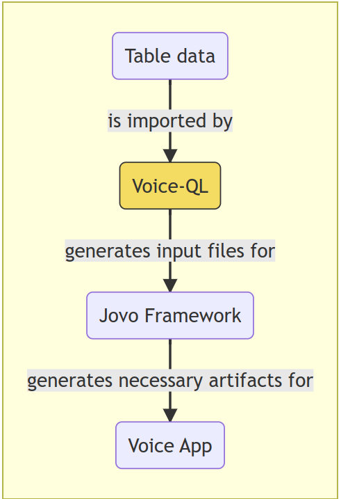
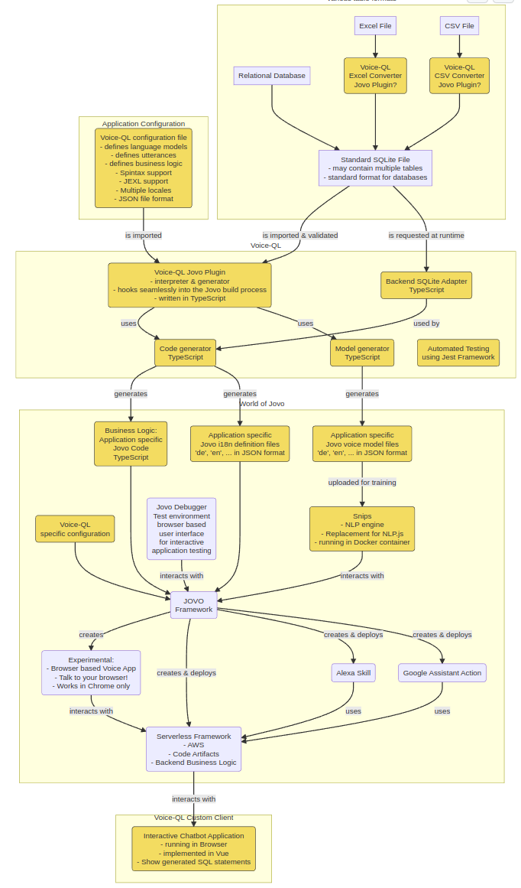
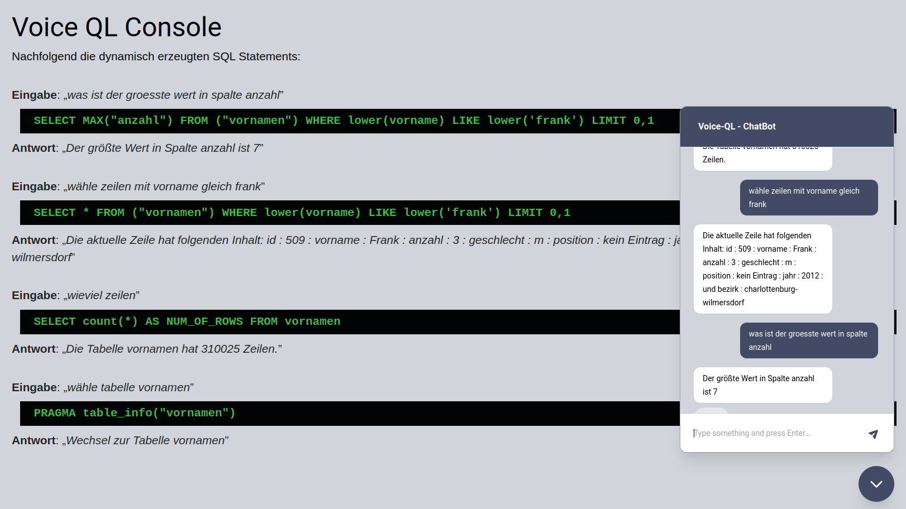

# **Voice QL**

Talk to your Database

Build SQL statements from natural language requests

<!-- 
footer: "Voice QL - Frank Börncke - www.boerncke.de"
-->

---

# How it works 

- Choose table in SQLite format 
- Initiate **Voice QL** generator
- Use created code artifacts for ...
   - ... NLP Webservices
   - ... Web based dialog system
   - ... Alexa Skill
   - ... Google Assistant action
   - ... other Jovo output formats

---

# Architecture

- The **grey** elements existed already.

- The elements marked **yellow** have been implemented while building **Voice QL**

---

# Voice App builds SQL from utterances

Voice QL is about talking to your database. Say something like:

- "*Wieviele Zeilen hast Du?* "
- "*Wieviele Zeilen hat die aktuelle Tabelle?* "
- "*SELECT count STERNCHEN FROM SOME_TABLE*"
- "*Anzahl Zeilen!*"

       ==> SELECT count(*) FROM SOME_TABLE

---

# How does this work?

**Voice models** are trained based on sentence lists. Such lists tend to be **very long** and are **difficult to maintain** if they grow over time.

    [
      "Wieviele Zeilen hast Du?",
      "Wieviele Zeilen hat die aktuelle Tabelle",
      "select count sternchen from some_table",
      "Anzahl Zeilen",
      ... many other 10/100/1000 sample utterances ... 
    ]

This approach is still **state of the art** with many platforms.

---

# Tools simplify Voice Model creation

**Voice QL** comes with a tool to make this much easier. 

**Spintax**: Sentence lists are generated based on a compact description using a regular expression like language / syntax. 

**Example**: The SQL `SORT` action is triggered by 24 sentences based on one Spintax expression:

    "[Ordne|Sort|Sortiere] nach [|Spalte|Eigenschaft|column] {columnName} [|{sortOrder}]"

--- 

# Spintax is maintainable and powerful

Most complex action is the SQL `SELECT` statement implementation:

The Spintax approach scales: with six lines of Spintax expressions **Voice QL** auto creates 3000+ sample utterances for the voice model:
 
    "{selectSynonym} [|alle|die] {rowSynonym} [| [FROM|von der Tabelle] {tableName} ] [WHERE|wo|bei denen] [|Spalte|der Wert [| von Spalte ] ]  {compareColumnName} {comparator} [|der Wert|dem Wert|mit dem Wert] [{integerNumber}|{someString}] ist ",

    "{selectSynonym} [|alle|die] {rowSynonym} [| [FROM|von der Tabelle] {tableName} ] mit [|einem Wert von|dem Wert]   [|Spalte] {compareColumnName} {comparator} [|der Wert|dem Wert|mit dem Wert] [{integerNumber}|{someString}]",

    "{selectSynonym} {filterColumnName} [| [FROM|von der Tabelle] {tableName} ] [WHERE|wo|bei denen] [|Spalte|der Wert [| von Spalte] ] {compareColumnName} {comparator} [|der Wert|dem Wert|mit dem Wert] [{integerNumber}|{someString}] ist ",

    "{selectSynonym} {filterColumnName} [| [FROM|von der Tabelle] {tableName} ] mit [|einem Wert von|dem Wert]   [|Spalte] {compareColumnName} {comparator} [|der Wert|dem Wert|mit dem Wert] [{integerNumber}|{someString}]",

    "{selectSynonym} [stern|sternchen|STAR] [| [FROM|von der Tabelle] {tableName} ] [WHERE|wo|bei denen] [|Spalte|der Wert [| von Spalte ] ] {compareColumnName} {comparator} [|der Wert|dem Wert|mit dem Wert] [{integerNumber}|{someString}] ist ",

    "{selectSynonym} [stern|sternchen|STAR] [| [FROM|von der Tabelle] {tableName} ] mit [|einem Wert von|dem Wert]   [|Spalte] {compareColumnName} {comparator} [|der Wert|dem Wert|mit dem Wert] [{integerNumber}|{someString}]"

Without the Spintax approach **Voice QL** would not be maintainable.

---

# Metadata is part of Voice Model

Voice QL makes sure that metadata like **table names** and **column names** automatically become **part of the voice model**. So you can ask for columns contents just by using column names.

"*Wähle Zeilen der Tabelle Vornamen mit Anzahl gleich 100*"

    SELECT * FROM vornamen WHERE anzahl = 100 LIMIT 1,1

This will not work for column names like `HELP`or `STOP` or `X16QS`.

---

# Support for Metadata

Say something like:

- "*Wie viele Zeilen hast Du?*"
- "*Wie viele Spalten hat die Tabelle?* "
- "*Wie heissen die Spalten?*"
- "*Wie heisst Spalte 3?*"
---

# Support for non trivial queries

Say something like:

- "*Was ist der größte Wert in der Spalte Einwohnerzahl?* "
- "*Filtere Zeilen mit Einwohnerzahl größer als 100.000* "
- "*Sortiere nach Spalte Einwohnerzahl absteigend.*"

---

# Access contents of a table 

Challenge: How to present (maybe very) long result lists using voice?

We read the **first line of a result set** by default.

Other content is read aloud row by row on request.

Say something like:

- "*Was steht in Zeile 1234?*"
- "*Was steht in der aktuellen Zeile?*"

---

# Navigate in/between tables via voice

Say something like:

- "*Gehe in die erste Zeile*"
- "*Gehe in die letzte Zeile*"
- "*Eine Zeile weiter*"
- "*Eine Zeile zurück*"
- "*Wechsle zur Tabelle Ersatzteilliste*"

---

# Conversational context support

Say something like:

- "*Wähle Tabelle Vornamen*"
- "*Wieviel Zeilen hat diese Tabelle*" (refers to table **Vornamen**)
- "*Wähle Tabelle Nachnamen*"
- "*Wieviel Zeilen hat diese Tabelle*" (refers to table **Nachnamen**)

---

# Collects missing information

**Voice QL** does its best to keep the dialog running instead of reporting error messages:

- "*Wie viele Zeilen hat die aktuelle Tabelle?*"

- Antwort: "*Du hast noch keine Tabelle ausgewählt. Es gibt die Tabellen mit den Namen  'Vornamen' oder 'Nachnamen'* "

- "*Wähle Tabelle Nachnamen*"

- Answer: "*Die aktuelle Tabelle  hat 357.000 Einträge.*"

---

# Tools built around Voice QL

A number of Jovo tools / plugins have been created while implementing **Voice QL**:

- **Jovo** Plugins:
  - Model Linter (published)
  - Magic Model (published)
  - Magic Prototyper (work in progress)

- **Chatbot** web application shows auto generated SQL statements

---

# Chatbot

A web application allows to chat with databases and shows the created SQL statements  on the fly. 

---

#  

---

# Multi locale support built-in

Though not in the focus of the project all components developed for **Voice QL** are prepared to work for multiple locales/languages.

The demo implementation works for German of course but the configuration includes basic settings for English already. 

If target platforms support languages like "*French*", "*Spanish*", "*Italian*" then this will work with **Voice QL**.

---

# Jovo Team

All **Voice QL** tools can be reused for other voice apps.

The Jovo Team said "*Thank You*" for my contributions that have been created while implementing **Voice QL** 🙂

---

# Needs to be done

- Refine the dialogues used in Voice QL
- Publish homepage which is still work in progress
- Add documentation
- Prepare all the code in a way that makes it work more or less out of the box (Docker image?)
- Out of scope: SQL `JOIN` or `GROUP BY` constructs?

---

# Thank you!

## Any questions or remarks?