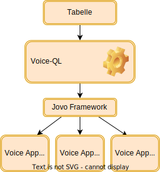

# 
**Voice**

# 
**QL**

<!--
footer: "Voice-QL - Talk to your Database - Frank Börncke - www.boerncke.de"
-->

---

## 
Worum geht es?

$$\\[20pt]$$

*„Voice-QL ermöglicht die Kommunikation mit einer Tabelle oder Datenbank in natürlicher Sprache.“*

<!-- backgroundImage: "linear-gradient(to bottom, #EFEFEF, #FFFFFF)" -->

---

## 
Hintergrund

$$\\[3pt]$$

- Frank Börncke

- Sprachverarbeitung und NLP (neudeutsch *„Voice“* )

- Systeme, die mit natürlicher Sprache bedient werden

$$\\[0pt]$$

- Kein Bildschirm, keine Tastatur, keine Maus, kein Touch

- Für viele Menschen ist das Alltag

---

## 
Warum mache ich das?

$$\\[3pt]$$

Brücken bauen und Barrieren aus dem Weg räumen macht Spaß

$$\\[3pt]$$

Die Idee hatte ich schon länger in der Schublade

$$\\[3pt]$$

Mit der Unterstützung vom Prototype Fund hatte ich die Möglichkeit, mich nun länger diesem Thema zu widmen.

---

## 
Tabellen erscheinen einfach

Tabellen sind ein **einfach** zu verstehendes Konzept:

   - Zeilen
   - Spalten
   - Zellen

Wir alle nutzen Tabellen: Datenbanken, Open/Libre Office, Excel

Auch **Open Data** verwendet Tabellen. Einheitliche Standardformate existieren nicht. Das erschwert Navigation und Orientierung.

---

## 
Tabellen sind kompliziert

$$\\[10pt]$$

Tabellen versprechen **Struktur und Ordnung**

$$\\[10pt]$$

Aber was wir vorfinden, ist häufig ein **komplexes Durcheinander**

---

## 
Warum ist das so?

$$\\[3pt]$$

Es ist **leicht**, Daten in Tabellen zu gießen

$$\\[3pt]$$

Es ist **schwer**, Informationen aus Tabellen zu extrahieren

$$\\[3pt]$$

Wird das zu einer **Einbahnstraße**, dann schaffen wir **Datenfriedhöfe**

---

## 
Ursachen

$$\\[5pt]$$

Tabellen sind eben **kein** einfach zu verstehendes Konzept

Inhalte oft umfangreich (Ergebnisse leider auch)

Uneinheitlicher Formate / Strukturen (siehe **Open Data**)

Nicht jeder beherrscht Excel oder Abfragesprachen wie SQL

---

## 
Wo führt das alles hin?

$$\\[1pt]$$

Tabellen sind implizit barrierebehaftet!

Bei technischen Neuentwicklungen werden Fragen der Zugänglichkeit oft nicht berücksichtigt oder mitgedacht. 

Wo das passiert, da kann Fortschritt zur Ausgrenzung führen. 

Dagegen müssen wir was tun!

---

## 
Voice-QL: sprich mit Deiner Datenbank

Können wir mit einem Sprach-Assistenten über eine Tabelle reden?

    "Was ist der größte Wert in der Spalte Einwohnerzahl?"

Können wir sogar direkt mit einer Tabelle sprechen?

    "Wie heißen Deine Spaltennamen?"
    "Erzähle mir was über Dich!"

Darum geht es bei Voice-QL.

---

## 
Herausforderungen an das System

$$\\[10pt]$$

Intention des Nutzers erkennen

$$\\[7pt]$$

Passende Information aus der Datenbank holen

$$\\[7pt]$$

Ergebnisse mit Sprache präsentieren

---

## 
Intention des Nutzers erkennen

- Was interessiert den Anwender? `"Summe berechnen"`

- Auf welche(n) Tabelle / Zeile / Spalte / Bereich bezieht er sich?
  `"Zeige mir die Summe der Werte aus der Spalte Verkauf"`

- Ist ein Filter definiert?
  `"Mich interessieren nur Daten aus dem Jahr 2018"`

Ein **Context** merkt sich frühere Entscheidungen des Benutzers. 

**Fehlertoleranz**: Informationen werden im **Dialog** eingesammelt. 

---

## 
Datenbankabfrage  (SQL)

Datenbank-Zugriff sollte trivial sein. Aber die reale Welt ist gemein:

- Schreibweisen: `Zwölf`, `zwoelf` vs. `12`

- Verschiedene Begriffe klingen gleich: `Ja` vs. `Jahr`

- Kryptische Spaltennamen: `X19Q3`

- Datenqualität: `
grün
` (Markup)

---

## 
Ergebnisse vorlesen

- Ergebnisse können (sehr) lang und umfangreich sein. 
  Einfach alles vorlesen ist nicht praktikabel.

- Lösung: **Cursorkonzept** mit Sprachnavigation
  `"Lies die aktuelle Zeile"`
  `"Gehe in die erste / letzte / nächste ... Zeile"`

$$\\[1pt]$$

- Inhalte wie&nbsp;  `true, false, null, #nbsp;, "", ...` machen Arbeit

---

## 
Voice-QL

1. Metadaten & DB auswerten
2. Code generieren:
  - trainierbare Sprachmodelle
  - Voice-App-Prototypen:
    - Voice-Applikationen
    - Webanwendung
    - Chatbot

---

## 
Ausblick - Ist das die Zukunft?

Für jede Tabelle eine eigene Anwendung? Sicher nicht.

- **Multimodalität**: klassische UI mit ergänzendem Sprachassistent

Voraussetzung:

- Inhalte **barrierearm** aufbereiten: Struktur und Datenqualität

- Von Anfang an die **Tools** des Nutzers mitdenken

Wenn das gelingt, kann jeder Nutzer von Voice-QL profitieren.

---

## 
Fragen und Antworten

<!-- _backgroundColor: white -->
